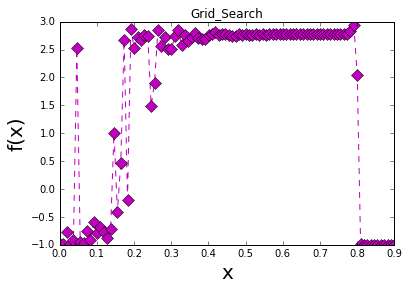
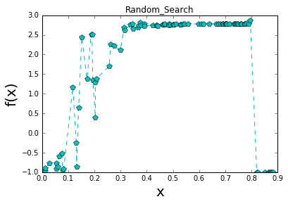
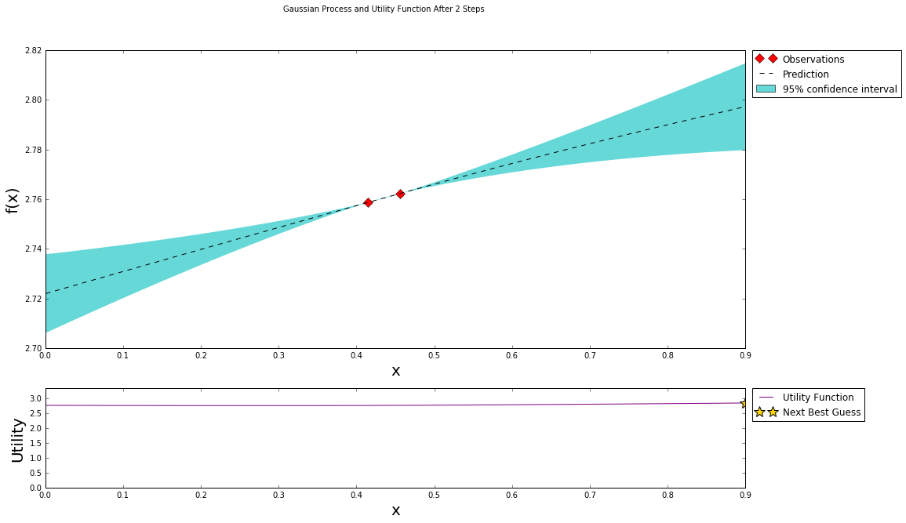
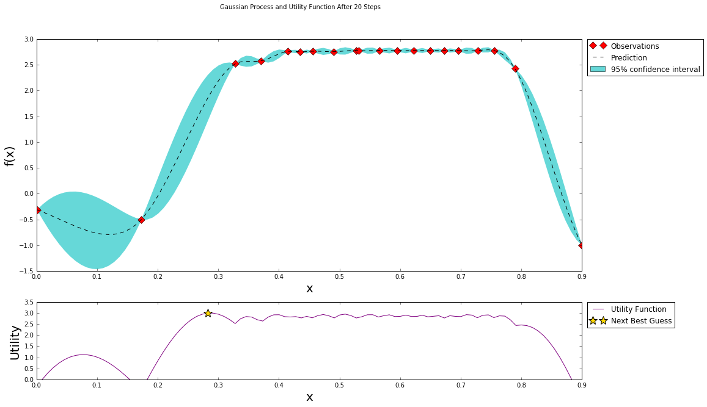

# Bayesian_Optimization
This is showing simple baysian optimization at linear regression

## Introduction
The notebook "baysian_optimization.ipynb" introduces how to find the best hyperparameters value.

## Contents
1. load the kospi.csv data.
2. make the dataset for training and testing after normalization.
3. build the linear regression model.
4. search best learning rate for linear regression using baysian optimization.
5. search best learning rate for linear regression using grid searching.
6. search best learning rate for linear regression using random searching.

## Grid Search

## Random Search

## Baysian Optimization

* First initial 2 points for baysian optimization

* after 20 points, for baysian optimization

## Conclusion
For complex ML model, the baysian optimization is good but for simple, is not.
For simple ML model, Let's use the random search.

## Dependencies
* numpy
* Pandas
* tensorflow
* BayesianOptimization
* matplotlib
* random
* datetime

All dependencies can be installed using [pip](https://pip.pypa.io/en/stable/)
